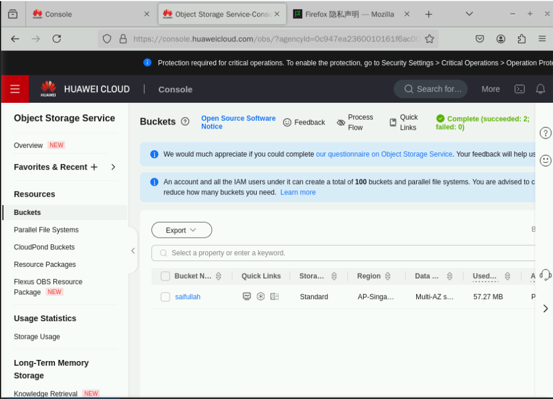
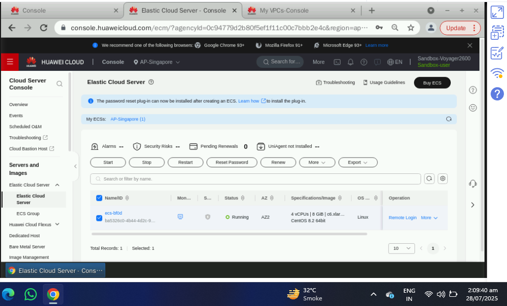
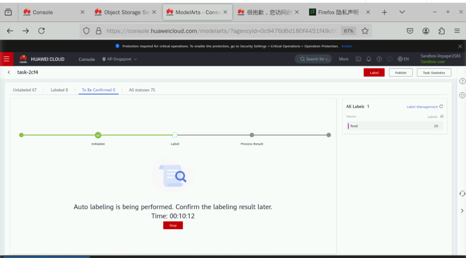

## 🧠 HCCDA-CLOUD Lab: Intelligent Labeling Exercise

This lab demonstrates how I used Huawei ModelArts' **Intelligent Labeling** tool to preprocess and annotate image datasets using AI. These steps were performed as part of the HCCDA-CLOUD practical lab exercise.

---

### 📸 Step 1: Upload Dataset
  
I uploaded an image dataset to Huawei ModelArts in preparation for intelligent labeling.

---

### ⚙️ Step 2: Open Labeling Tool
  
I accessed the intelligent labeling interface to begin the annotation process.

---

### 🧾 Step 3: Create Labeling Task
  
I created a new labeling task by defining project parameters and dataset type.

---

### 🧠 Step 4: Enable AI-Assisted Labeling
  
I enabled intelligent labeling so the system could automatically detect and suggest labels.

---

### 🖼️ Step 5: Preview Image Dataset
  
I browsed through the uploaded images to verify they loaded correctly before labeling.

---

### 🧷 Step 6: Define Object Classes
  
I defined label classes (e.g., car, person, etc.) to help guide the auto-labeling process.

---

### 🤖 Step 7: Auto-Labeling Execution
  
I let ModelArts automatically generate labels using pre-trained AI models.

---

### 🛠️ Step 8: Manual Correction
  
I reviewed and adjusted the automatically generated labels to improve accuracy.

---

### 📊 Step 9: Save Labeling Results
  
I saved all validated labels to associate them with the training dataset.

---

### 📁 Step 10: Export Dataset
  
I exported the labeled dataset for use in AI model training later in the lab.

---

### 🔍 Step 11: Review Label Statistics
  
I reviewed statistics and counts for each label category to ensure data balance.

---

### ✅ Step 12: Task Completion

