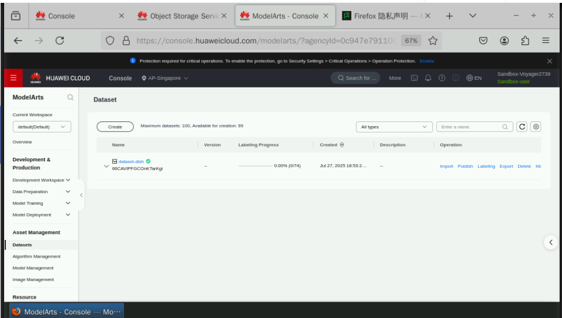
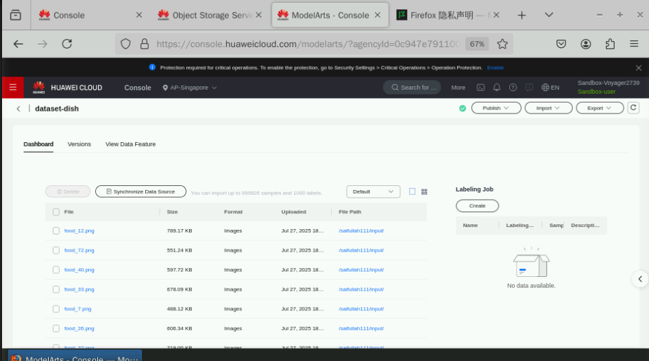
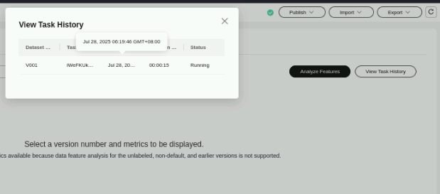
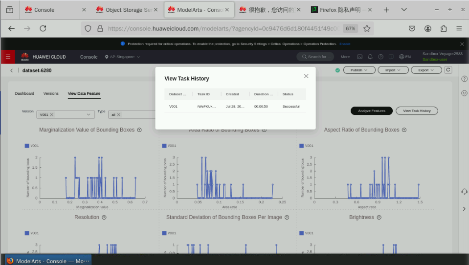

# ModelArts Object Storage and Image Labeling Exercise

## Overview
This exercise demonstrates the process of creating a dataset, labeling images, and using auto-labeling features in Huawei Cloud's ModelArts service.

## Exercise Steps

### 1. Accessing ModelArts Console
Navigated to ModelArts through the Huawei Cloud console:

### 2. Creating a Dataset
Created a new dataset with the following parameters:
- Name: `dataset-dish`
- Description: User-defined
- Data Type: Images
- Import Path: Selected input folder
- Labeling Status: Labeled
- Output Dataset Path: Selected output folder

Dataset creation in progress:

### 3. Creating a Labeling Task
Configured labeling task with:
- Name: `task-dish`
- Description: User-defined
- Labeling Scene: Images
- Labeling Type: Object detection
- Dataset Name: `dataset-dish`

Labeling task interface:

### 4. Auto-Labeling Process
Enabled auto-labeling with:
- Auto Labeling Type: Active learning
- Algorithm Type: Fast
- Specifications: Default

Auto-labeling configuration:

### 5. Reviewing Labeling Results
- Total images: 74
- Unlabeled: 74 (initially)
- Labeled: 25 after first phase
- Used active learning to label remaining images

Labeling progress:

### 6. Final Verification
Manually verified and corrected auto-labeling results:
- Confirmed accurate labels
- Deleted incorrect labeling boxes
- Added missing labels manually

### 7. Feature Analysis
Completed feature analysis on the labeled dataset to prepare for model training.

## Conclusion
Successfully completed all steps of the image labeling exercise using Huawei Cloud ModelArts, including:
- Dataset creation and import
- Manual labeling initiation
- Auto-labeling implementation
- Results verification and correction
- Feature analysis preparation

The exercise demonstrated the efficiency gains from using active learning-based auto-labeling while highlighting the importance of manual verification for accuracy.
